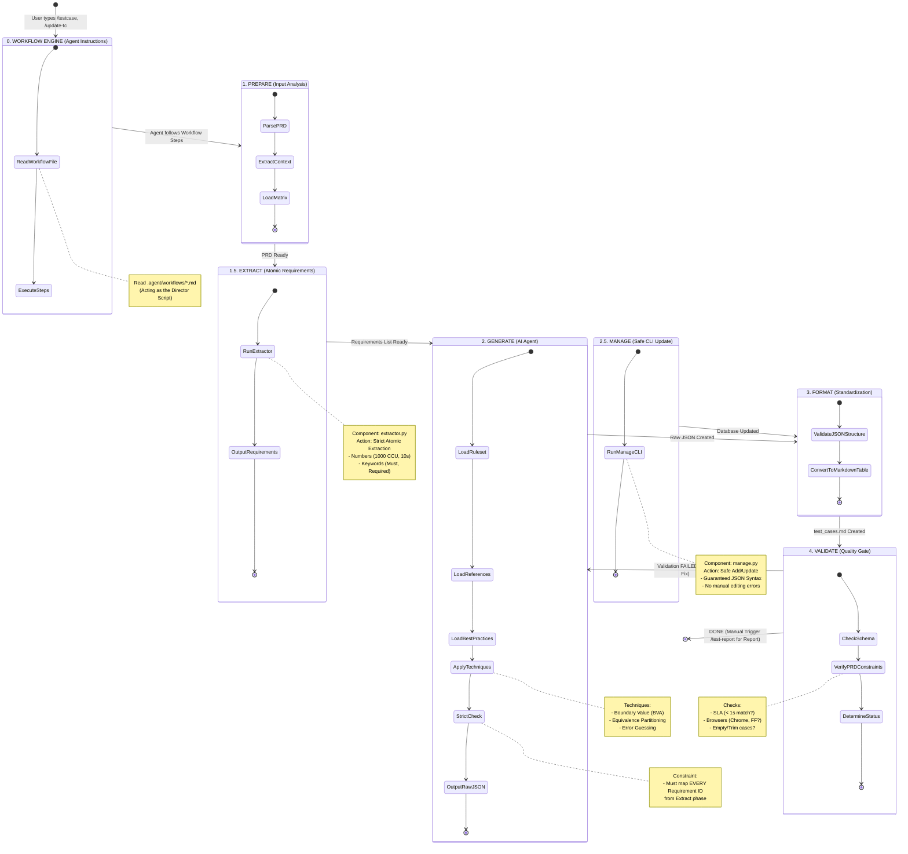

# 🔄 Test Generation State Transition Diagram

Tài liệu này mô tả chi tiết quy trình xử lý của Tool `test-gen` dưới dạng biểu đồ chuyển đổi trạng thái (State Transition Diagram).

## 📊 Biểu đồ Tổng Quan (Mermaid)

## 📝 Giải thích Chi tiết các Trạng thái

### 0. WORKFLOW ENGINE (Khởi tạo)

- **Trigger:** Người dùng gõ lệnh `/testcase`, `/update-tc`.
- **Action:**
  - AI đọc file hướng dẫn `.agent/workflows/*.md`.
  - Đây là "Kịch bản đạo diễn" (Director Script) chỉ đạo AI phải làm gì tiếp theo (chạy code nào, đọc file nào).
- **Transition:** Chuyển sang bước PREPARE theo hướng dẫn trong file workflow.

### 1. PREPARE (Chuẩn bị)

- **Input:** PRD file, Swagger (nếu có), Matrix definition.
- **Action:**
  - `PRDParser`: Đọc và phân tích file Markdown, tách các header.
  - `ContextLoader`: Gom nhóm thông tin môi trường, ruleset.
- **Output:** `output/run_context.json`.

### 1.5. EXTRACT (Bóc tách Yêu cầu - MỚI)

- **Component:** `extractor.py` (Atomic Parser).
- **Action:**
  - Quét PRD tìm các "Atomic Requirements" (Yêu cầu đơn nguyên).
  - Tự động detect: Con số (1000, 10s), Từ khóa bắt buộc (Must, Tuyệt đối).
- **Output:** `output/requirements.json` (Danh sách Checklist bắt buộc).

### 2. GENERATE (Sinh Test Case)

- **Input:** `run_context.json` + `requirements.json` (từ bước Extract) + `testRuleset.md` + `references.md` + `best_practices.md`.
- **Action:**
  - AI áp dụng các kỹ thuật kiểm thử (BVA, EP...).
  - **Strict Mapping:** Bắt buộc map từng Item trong `requirements.json` ra ít nhất 1 Test Case.
  - Đối chiếu với "Strict Rules" (không tin lời nói miệng, chỉ tin file).
- **Output:** `output/raw_testcases.json`.

### 2.5. MANAGE (Quản lý Safe CLI - MỚI)

- **Component:** `manage.py`.
- **Purpose:** Thay thế việc sửa file JSON thủ công dễ gây lỗi.
- **Action:**
  - Cung cấp CLI để Thêm/Sửa Test Case an toàn.
  - Đảm bảo JSON Syntax luôn đúng 100%.

### 3. FORMAT (Định dạng)

- **Component:** `format_output.py`.
- **Action:**
  - Chuyển JSON thô thành Markdown Table thân thiện với người đọc.
  - **Enhanced Error Handling:** Báo lỗi chính xác dòng/cột nếu JSON bị hỏng.
  - Sắp xếp cột: ID, Priority, Title, Steps, Expected, Status, Create date.
- **Output:** `output/test_cases.md`.

### 4. VALIDATE (Kiểm tra)

- **Critical Step:** Được coi là "Quality Gate" (Cổng chất lượng).
- **Checks:**
  - **Performance:** So sánh số liệu trong Test Case (VD: 1000ms) với PRD (VD: < 1s).
  - **Browser:** Đảm bảo đủ danh sách trình duyệt yêu cầu.
  - **Security:** Bắt buộc phải có case XSS, SQLi nếu có input field.
- **Transition:**
  - Nếu **Pass**: Hoàn tất quy trình Sinh Test Case.
  - Nếu **Fail**: Quay lại bước Generate (hoặc user sửa tay rồi chạy lại).
