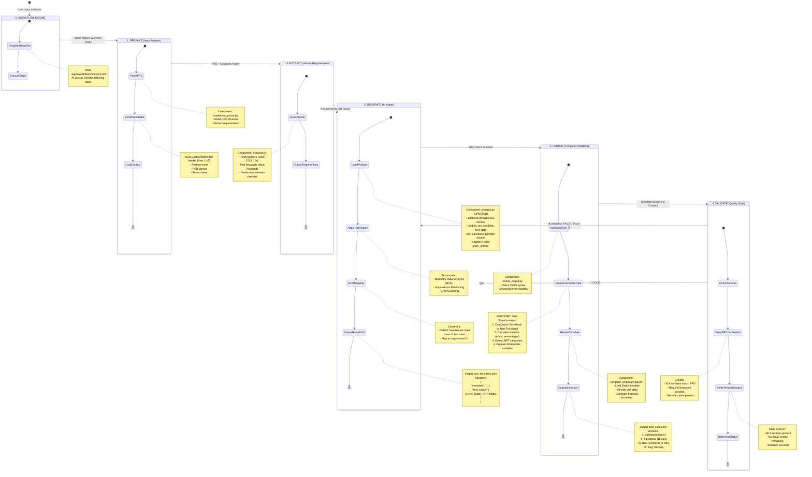
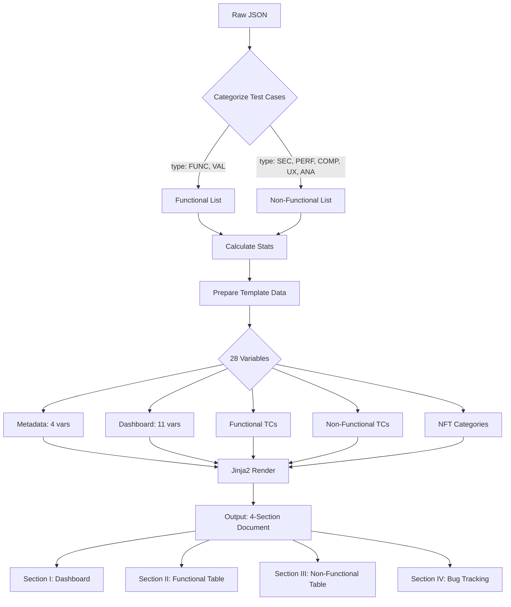
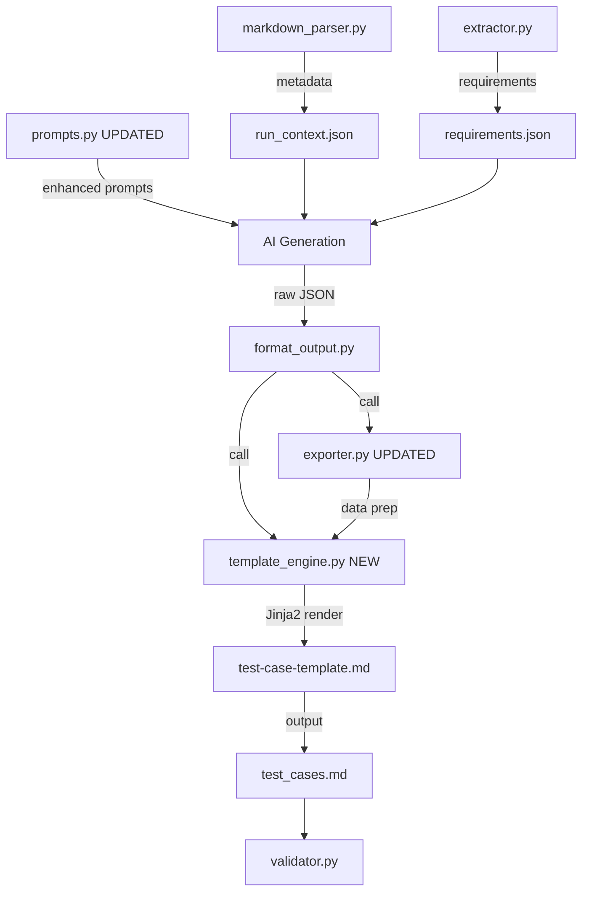

# 🔄 Test Generation Workflow with Template Rendering

Tài liệu này mô tả chi tiết quy trình xử lý của Tool `test-gen` với **Template-Based Output** dưới dạng biểu đồ chuyển đổi trạng thái.

**Version:** 2.0 (Updated with Jinja2 Template Integration)

---

## 📊 Biểu đồ Tổng Quan (Mermaid)



---

## 🆕 Template Rendering Flow (Detail)



---

## 📝 Chi tiết các Trạng thái

### 0. WORKFLOW ENGINE (Khởi tạo)

- **Trigger:** User gõ `/testcase`, `/update-tc`
- **Action:**
  - AI đọc `.agent/workflows/*.md`
  - Thực thi từng step trong workflow
- **Transition:** Chuyển sang PREPARE

---

### 1. PREPARE (Chuẩn bị) - UPDATED

- **Input:** PRD file
- **Action:**
  - `PRDParser`: Parse markdown structure
  - **NEW:** `extract_metadata()` - Lấy feature name, version, tester từ PRD header
  - `ContextLoader`: Tổng hợp context
- **Output:**
  - `output/run_context.json` (có thêm `metadata` section)

**Example Metadata Extraction:**

```markdown
PRD Header (lines 1-15):
**Feature:** User Signup
**Phiên bản:** 1.0.0
**Người thực hiện:** Nguyễn Văn A

Extracted:
{
"metadata": {
"feature_name": "User Signup",
"prd_version": "1.0.0",
"tester": "Nguyễn Văn A"
}
}
```

---

### 1.5. EXTRACT (Bóc tách Yêu cầu)

- **Component:** `extractor.py`
- **Action:**
  - Scan PRD tìm atomic requirements
  - Detect numbers: `1000 CCU`, `< 1s`
  - Detect keywords: `Must`, `Required`, `Tuyệt đối`
- **Output:** `output/requirements.json`
- **No Changes:** Same as before

---

### 2. GENERATE (Sinh Test Case) - UPDATED

- **Input:**
  - `run_context.json` (with metadata)
  - `requirements.json`
  - Updated prompts
- **Action:**
  - AI generates test cases with **NEW fields**:
    - **Functional:** `module`, `pre_condition`, `test_data`
    - **Non-Functional:** `category`, `tools`, `pass_criteria`
  - Apply BVA, EP, Error Guessing
  - Strict mapping to requirements
- **Output:**
  - `output/raw_testcases.json`

**Example Output Structure:**

```json
{
  "metadata": {
    "feature_name": "User Signup",
    "prd_version": "1.0.0",
    "tester": "QA Team"
  },
  "test_cases": [
    {
      "id": "TC-SIGNUP-FUNC-001",
      "module": "Authentication",
      "type": "FUNC",
      "title": "Successful Registration",
      "pre_condition": "User is logged out",
      "steps": ["Navigate to signup", "Fill form", "Click submit"],
      "test_data": "email=test@ex.com, password=Pass@123",
      "expected_result": "Account created",
      "priority": "P0"
    },
    {
      "id": "TC-SIGNUP-SEC-001",
      "type": "SEC",
      "category": "Security",
      "title": "XSS Injection Test",
      "steps": ["Enter script tag", "Submit"],
      "tools": "Burp Suite",
      "pass_criteria": "Input rejected OR sanitized",
      "priority": "P0"
    }
  ]
}
```

---

### 3. FORMAT (Template Rendering) - COMPLETELY NEW

**Major Changes:**

#### 3.1. ValidateJSON (Same)

- Check JSON syntax
- Enhanced error reporting

#### 3.2. PrepareTemplateData (NEW)

**Component:** `exporter.py::export_to_template_markdown()`

**Steps:**

1. **Categorize Test Cases:**

   ```python
   functional = [tc for tc in test_cases if tc['type'] in ['FUNC', 'VAL']]
   non_functional = [tc for tc in test_cases if tc['type'] not in ['FUNC', 'VAL']]
   ```

2. **Calculate Statistics:**

   ```python
   stats = {
       'total_cases': len(test_cases),
       'functional_count': len(functional),
       'non_functional_count': len(non_functional),
       'p0_count': count_by_priority('P0'),
       'p0_percent': round(p0_count / total * 100, 1),
       # ... P1, P2, P3
   }
   ```

3. **Extract NFT Categories:**

   ```python
   type_to_category = {
       'SEC': 'Security',
       'PERF': 'Performance',
       'COMP': 'Compatibility',
       'UX': 'Usability',
       'ANA': 'Analytics'
   }
   nft_categories = [type_to_category[tc['type']] for tc in non_functional]
   # Result: ['Security', 'Performance', 'Analytics']
   ```

4. **Prepare All 28 Variables:**
   ```python
   template_data = {
       # Metadata (4)
       'feature_name': metadata['feature_name'],
       'prd_version': metadata['prd_version'],
       'created_date': '2026-02-03',
       'tester': metadata['tester'],

       # Dashboard (11)
       'total_cases': 30,
       'functional_count': 20,
       'non_functional_count': 10,
       'p0_count': 5, 'p0_percent': 16.7,
       'p1_count': 15, 'p1_percent': 50.0,
       'p2_count': 8, 'p2_percent': 26.7,
       'p3_count': 2, 'p3_percent': 6.7,

       # Test Cases
       'functional_testcases': [...],      # List of dicts (11 fields each)
       'non_functional_testcases': [...],  # List of dicts (9 fields each)

       # NFT Categories
       'nft_categories': ['Security', 'Performance', 'Analytics']
   }
   ```

#### 3.3. RenderTemplate (NEW)

**Component:** `template_engine.py` (NEW FILE)

```python
from jinja2 import Environment, FileSystemLoader

def render_template(template_path, data):
    env = Environment(loader=FileSystemLoader('.'))
    template = env.get_template(template_path)
    return template.render(**data)
```

**Input:**

- Template: `test-gen/templates/test-case-template.md`
- Data: 28 variables

**Output:** Rendered markdown with 4 sections

#### 3.4. OutputMarkdown

**File:** `output/test_cases.md`

**Structure:**

```markdown
# 📘 TÀI LIỆU TEST CASE - User Signup

**Feature:** User Signup
**Phiên bản PRD:** 1.0.0
**Ngày tạo:** 2026-02-03
**Người thực hiện:** QA Team

---

## I. THỐNG KÊ TỔNG QUAN (DASHBOARD)

### 1. Tổng hợp số lượng

| Chỉ số                         | Giá trị |
| :----------------------------- | :------ |
| **Tổng số Test Case**          | **30**  |
| Functional (Chức năng)         | 20      |
| Non-Functional (Phi chức năng) | 10      |

### 2. Phân bố mức độ ưu tiên

| Mức độ                       | Số lượng | Tỷ lệ (%) |
| :--------------------------- | :------- | :-------- |
| **P0 (Critical - Blocker)**  | 5        | 16.7%     |
| **P1 (Cao - High)**          | 15       | 50.0%     |
| **P2 (Trung bình - Medium)** | 8        | 26.7%     |
| **P3 (Thấp - Low)**          | 2        | 6.7%      |

---

## II. KIỂM THỬ CHỨC NĂNG (FUNCTIONAL TESTING)

| ID                     | Phân hệ        | Tiêu đề                 | ... (11 columns total) |
| :--------------------- | :------------- | :---------------------- | :--------------------- |
| **TC-SIGNUP-FUNC-001** | Authentication | Successful Registration | ...                    |

---

## III. KIỂM THỬ PHI CHỨC NĂNG (NON-FUNCTIONAL TESTING)

### 1. Phạm vi kiểm thử

- [x] **Performance** (Hiệu năng)
- [x] **Security** (Bảo mật)
- [ ] **Availability** (Tính sẵn sàng)
- [ ] **Reliability** (Độ tin cậy)
- [ ] **Usability** (Khả năng sử dụng)
- [ ] **Accessibility** (Khả năng truy cập)
- [ ] **Compatibility** (Tương thích)
- [x] **Analytics** (Phân tích dữ liệu)

### 2. Danh sách Test Case chi tiết

| ID                    | Phân loại (Group) | ... (9 columns total) |
| :-------------------- | :---------------- | :-------------------- |
| **TC-SIGNUP-SEC-001** | **Security**      | ...                   |

---

## IV. GHI CHÚ & THEO DÕI LỖI (BUG TRACKING)

| Bug ID | Liên kết (Jira/Issue) | Mức độ nghiêm trọng | Trạng thái |
| :----- | :-------------------- | :------------------ | :--------- |
|        |                       |                     |            |
```

---

### 4. VALIDATE (Quality Gate) - UPDATED

- **Existing Checks:**
  - Schema validation
  - SLA numbers match PRD
  - Browser coverage
  - Security test presence

- **NEW Checks:**
  - All 4 sections present in output
  - No Jinja2 syntax remaining (`{{`, `{%`)
  - Statistics accurate (manual verification)
  - Functional table has 11 columns
  - Non-Functional table has 9 columns
  - NFT checkboxes match actual test types

---

## 🔄 Data Flow Comparison

### OLD Flow (Before Template):

```
PRD → Extract → Generate → Format (Simple Table) → Validate
                              ↓
                     output/test_cases.md
                     (8-column table only)
```

### NEW Flow (With Template):

```
PRD → Extract Metadata → Generate (Enhanced) → Prepare Data → Render Template → Validate
      ↓                   ↓                     ↓              ↓
      metadata           +11 fields             28 vars        4 sections
                         Functional             + stats        - Dashboard
                         +9 fields              + categories   - Functional
                         Non-Functional                        - Non-Functional
                                                               - Bug Tracking
```

---

## 📋 Component Dependencies



---

## 🎯 Key Improvements

1. **Professional Output:** 4-section structured document vs simple table
2. **Metadata Tracking:** Feature name, version, tester automatically extracted
3. **Statistics Dashboard:** At-a-glance overview of test coverage
4. **Categorization:** Clear separation of Functional vs Non-Functional
5. **Auto-Detection:** NFT categories automatically checked based on test types
6. **Richer Data:** 11 fields for Functional, 9 for Non-Functional vs 8 generic
7. **Template-Based:** Easy to customize format without code changes
8. **Bug Tracking:** Built-in section for manual testing notes

---

## 🚀 Future Enhancements

- [ ] Multiple template support (Excel, PDF, HTML)
- [ ] Custom template selection via CLI flag
- [ ] Template preview mode
- [ ] Auto-link to Jira/GitHub issues
- [ ] Export to test management tools (TestRail, Zephyr)
