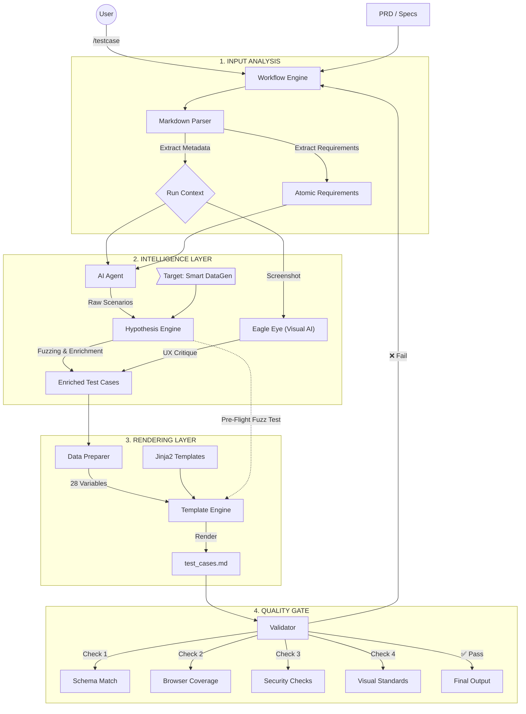

# 🔄 Test Generation Workflow (Architecture v2.1)

**Status:** Stable | **Integration:** Hypothesis (PBT) + Template Engine

## 📊 Core Architecture (The "Flow")

---

## 🚀 Workflow Stages Explained

### 1. Input Analysis (The "Eyes")

- **Metadata Extraction:** Automatically pulls Feature Name, Version, and Author from PRD headers.
- **Requirement Explosion:** Breaks down PRD paragraphs into atomic, testable check-items (1000 CCU, <1s latency, Must-haves).

### 2. Intelligence Layer (The "Brain")

- **AI Agent:** Generates logical scenarios using hardened prompts (BVA, Equivalence Partitioning).
- **Hypothesis Engine (✨ New):**
  - **Smart Data:** Replaces generic checks ("invalid email") with real edge-case data (`user@.com`, `👻`).
  - **Fuzzing strategy:** Injects random noise to ensure test robustness.
- **Visual Intelligence (👁️ Next):**
  - **Eagle Eye:** Uses Multimodal AI to review screenshots against UX principles.
  - **Critique:** Auto-checks contrast, alignment, and spacing consistency.

### 3. Rendering Layer (The "Artist")

- **Data Preparation:** Calculates coverage statistics (% P0/P1) and separates Functional vs. Non-Functional tests.
- **Template Engine:** Uses `Jinja2` to render professional, 4-section documentation with strict 11-column layouts.

### 4. Quality Gate (The "Judge")

- **Automated Checks:** Coverage, Security, Performance, and now **Visual Standards**.
- **Self-Correction:** Loops back if critical failures occur.

---

## 🛠 Component Map

| Component             | Responsibility      | Tech Stack              |
| :-------------------- | :------------------ | :---------------------- |
| `main.py`             | Orchestrator        | Python CLI              |
| `markdown_parser.py`  | Input Reader        | Regular Expressions     |
| `prompts.py`          | AI Instructions     | Prompt Engineering      |
| `data_fuzzer.py`      | Data Enrichment     | **Hypothesis**          |
| `template_engine.py`  | Document Generation | Jinja2                  |
| `visual_validator.py` | Visual QA           | **Native Agent Vision** |
| `validator.py`        | Quality Assurance   | PyTest / Schema         |

---

## 📈 Future Roadmap

- [ ] **Direct Jira Integration:** Push Validated TCs to Jira Board.
- [ ] **Excel High-Fidelity:** Generate `.xlsx` with colors and macros.
- [ ] **Visual Diffing:** Pixel-perfect design vs implementation check.
- [ ] **Test Execution:** Generate `pytest`/`playwright` scripts directly.
