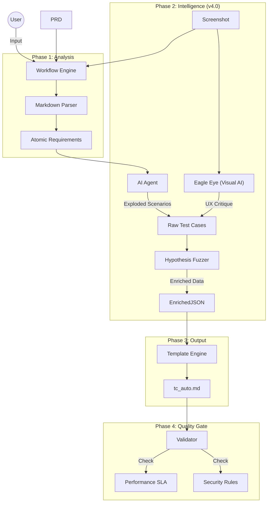

# 🔄 Test Generation Workflow (Architecture Evolution)

## 📊 1. Current Stable Architecture (v4.0 - Super Explosion)

The current system uses "Super Explosion" prompting with Hypothesis data enrichment and Visual QA.



---

## 🚀 2. Future Architecture (v5.0 - Smart Matrix) [PROPOSED]

**The Upgrade:** Shifts from "Generative Writing" to **"Algorithmic Expansion"**.

- **AI's Role:** Downgraded to "Architect" (Schema Extractor).
- **Python's Role:** Upgraded to "Factory" (Matrix Expansion).
- **Result:** 10x Coverage, 1/10th Token Cost.

```mermaid
graph TD
    %% Inputs
    User((User)) -->|PRD + Screen| Engine[Orchestrator]

    %% LAYER 1: The Brain (AI)
    subgraph "L1: KNOWLEDGE EXTRACTION (AI)"
        Engine -->|Prompt: Extract Schema| AI_Arch{AI Architect}

        AI_Arch -->|JSON Schema| Schema("DATA SCHEMA\n{field: 'age', type: 'int', min:18}")

        style Schema fill:#ff9,stroke:#333
    end

    %% LAYER 2: The Factory (Python)
    subgraph "L2: MATRIX EXPANSION (Python)"
        Schema --> Matrix[Matrix Engine]

        %% Expansion Logic
        Matrix -->|Rule: Integer| BVA[Boundary Value Analysis]
        Matrix -->|Rule: String| Sec[Security Payloads]
        Matrix -->|Rule: Enum|  Comb[Combinatorial]

        BVA & Sec & Comb --> GenCases[Generated Atomic Cases]
    end

    %% LAYER 3: Visual Intelligence (Preserved from v4.0)
    subgraph "L3: VISUAL INTELLIGENCE"
        Engine -->|Image| EagleEye[Eagle Eye]
        EagleEye -->|UX Rules| VisualCases[Visual Test Cases]

        VisualCases --> Merger
        GenCases --> Merger
    end

    %% LAYER 4: Realization
    subgraph "L4: ASSEMBLY & VALIDATION"
        Merger{Merger} --> Builder[Markdown Builder]
        Builder --> FinalDoc[Final Doc]

        FinalDoc --> Validator{Quality Gate}
        Validator -->|Pass| Success((Done))
        Validator -->|Fail| Loop[Self-Correction]
    end

    %% Styles
    style AI_Arch fill:#f9f,stroke:#333
    style Matrix fill:#bbf,stroke:#333
```

### Key Differences (v4.0 vs v5.0)

| Feature          | v4.0 (Current)                      | v5.0 (Smart Schema)                     | Benefits              |
| :--------------- | :---------------------------------- | :-------------------------------------- | :-------------------- |
| **Logic Source** | AI writes text ("Verify age is 18") | AI defines rule (`{age: int, min: 18}`) | No Hallucinations     |
| **Expansion**    | Limited by AI context               | Infinite (Python loop)                  | 100+ TCs easy         |
| **Data Quality** | "Random" or "Placeholder"           | Precise BVA (Min-1, Max+1)              | Guaranteed edge cases |
| **Visual QA**    | Separate Step                       | Parallel Stream                         | Integrated coverage   |

---

## 🛠 Component Map (v5.0)

| Component             | Responsibility                               | Status      |
| :-------------------- | :------------------------------------------- | :---------- |
| `main.py`             | Orchestrator                                 | ✅ Existing |
| `schema_models.py`    | **(NEW)** Pydantic Models for Data Schema    | ⬜ To Do    |
| `matrix_engine.py`    | **(NEW)** Python Logic for BVA/Combinatorics | ⬜ To Do    |
| `prompts.py`          | Updated with `SCHEMA_EXTRACTION_PROMPT`      | 🔄 Update   |
| `visual_validator.py` | Eagle Eye Integration                        | ✅ Existing |
| `validator.py`        | Final Sanity Check                           | ✅ Existing |
