# 🔄 Test Generation Workflow (Architecture v2.1)

**Status:** Stable | **Integration:** Hypothesis (PBT) + Template Engine

## 📊 Core Architecture (The "Flow")

```mermaid
graph TD
    %% User Input
    User((User)) -->|"/testcase"| Main[Workflow Engine]
    PRD[PRD / Specs] --> Main

    %% Phase 1: Preparation
    subgraph "1. INPUT ANALYSIS"
        Main --> Parser[Markdown Parser]
        Parser -->|Extract Metadata| Context{Run Context}
        Parser -->|Extract Requirements| Req[Atomic Requirements]
    end

    %% Phase 2: Intelligence
    subgraph "2. INTELLIGENCE LAYER"
        Context --> AI[AI Agent]
        Req --> AI

        AI -->|Raw Scenarios| Hypo[Hypothesis Engine]

        note1>Target: Smart DataGen] --> Hypo
        Hypo -->|Fuzzing & Enrichment| EnrichedJson[Enriched Test Cases]
    end

    %% Phase 3: Rendering
    subgraph "3. RENDERING LAYER"
        EnrichedJson --> Exporter[Data Preparer]
        Exporter -->|28 Variables| TmplEng[Template Engine]

        Tmpl[Jinja2 Templates] --> TmplEng
        TmplEng -->|Render| Markdown[test_cases.md]
    end

    %% Phase 4: Quality Assurance
    subgraph "4. QUALITY GATE"
        Markdown --> Validator[Validator]

        Validator -->|Check 1| Schema[Schema Match]
        Validator -->|Check 2| Browser[Browser Coverage]
        Validator -->|Check 3| Security[Security Checks]

        Validator -- "❌ Fail" --> Main
        Validator -- "✅ Pass" --> Final[Final Output]
    end

    %% Self-Healing Loop
    Hypo -.->|Pre-Flight Fuzz Test| TmplEng
```

---

## 🚀 Workflow Stages Explained

### 1. Input Analysis (The "Eyes")

- **Metadata Extraction:** Automatically pulls Feature Name, Version, and Author from PRD headers.
- **Requirement Explosion:** Breaks down PRD paragraphs into atomic, testable check-items (1000 CCU, <1s latency, Must-haves).

### 2. Intelligence Layer (The "Brain")

- **AI Agent:** Generates logical scenarios using hardened prompts (BVA, Equivalence Partitioning).
- **Hypothesis Engine (✨ New):**
  - **Smart Data:** Replaces generic checks ("invalid email") with real edge-case data (`user@.com`, `👻`).
  - **Fuzzing strategy:** Injects random noise to ensure test robustness.

### 3. Rendering Layer (The "Artist")

- **Data Preparation:** Calculates coverage statistics (% P0/P1) and separates Functional vs. Non-Functional tests.
- **Template Engine:** Uses `Jinja2` to render professional, 4-section documentation with strict 11-column layouts.

### 4. Quality Gate (The "Judge")

- **Automated Checks:**
  - Is the table format broken?
  - Are strict SLAs from PRD met?
  - Is Security testing included?
- **Self-Correction:** If validation fails, the workflow loops back to regenerate or fix formatting automatically.

---

## 🛠 Component Map

| Component            | Responsibility      | Tech Stack          |
| :------------------- | :------------------ | :------------------ |
| `main.py`            | Orchestrator        | Python CLI          |
| `markdown_parser.py` | Input Reader        | Regular Expressions |
| `prompts.py`         | AI Instructions     | Prompt Engineering  |
| `data_fuzzer.py`     | Data Enrichment     | **Hypothesis**      |
| `template_engine.py` | Document Generation | Jinja2              |
| `validator.py`       | Quality Assurance   | PyTest / Schema     |

---

## 📈 Future Roadmap

- [ ] **Direct Jira Integration:** Push Validated TCs to Jira Board.
- [ ] **Excel High-Fidelity:** Generate `.xlsx` with colors and macros.
- [ ] **Test Execution:** Generate `pytest` scripts directly from TCs.
